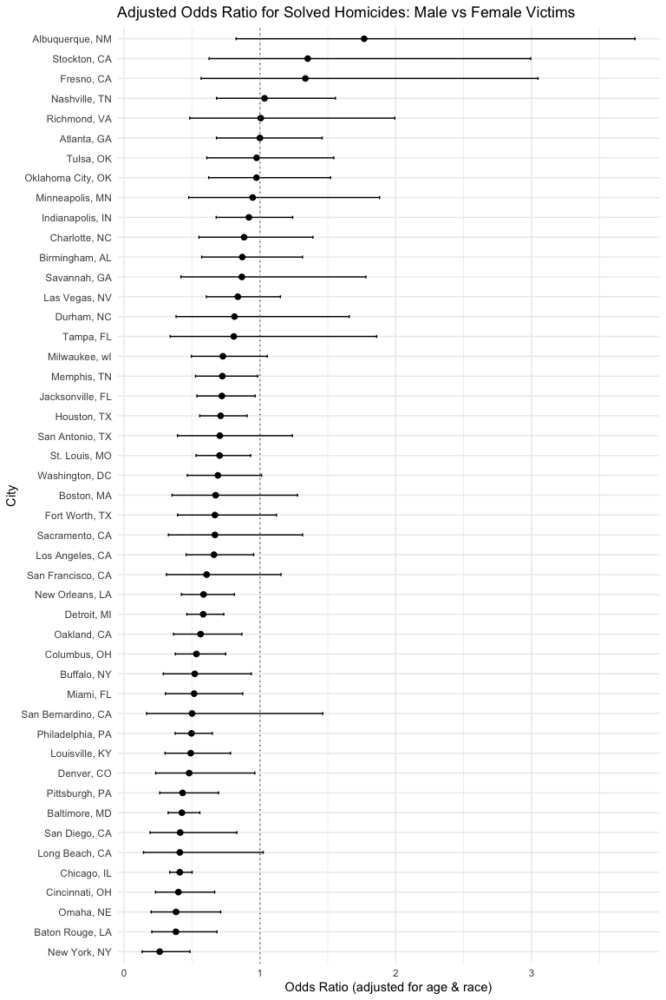
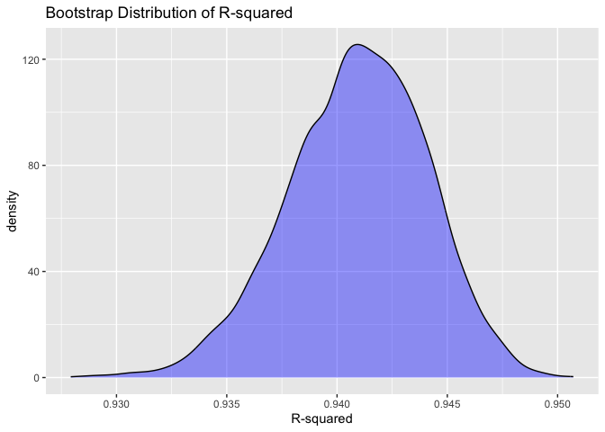
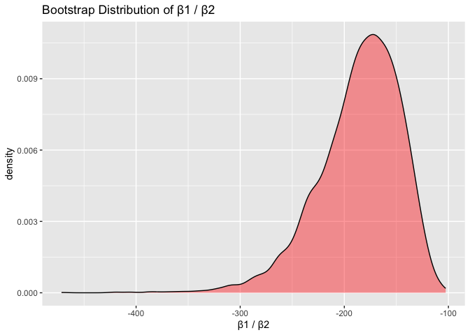
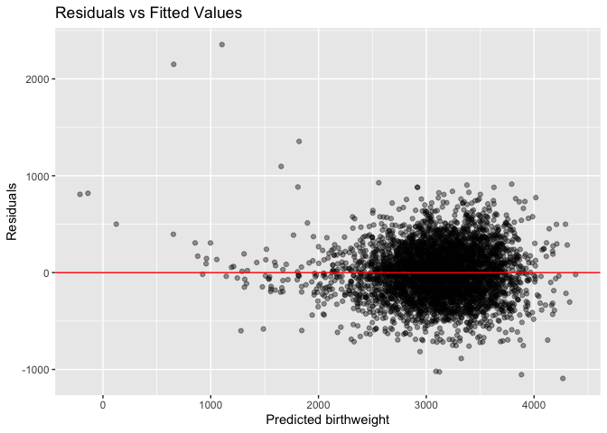
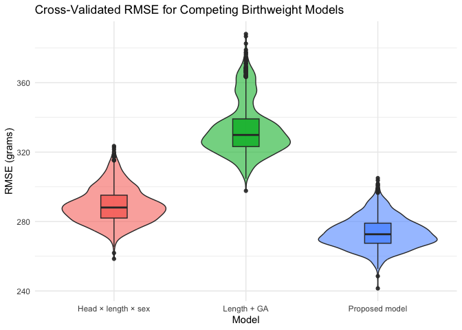

p8105_hw6_jw3638.Rmd
================

Load packages

``` r
library(tidyverse)
```

    ## ── Attaching core tidyverse packages ──────────────────────── tidyverse 2.0.0 ──
    ## ✔ dplyr     1.1.4     ✔ readr     2.1.5
    ## ✔ forcats   1.0.0     ✔ stringr   1.5.1
    ## ✔ ggplot2   3.5.2     ✔ tibble    3.3.0
    ## ✔ lubridate 1.9.4     ✔ tidyr     1.3.1
    ## ✔ purrr     1.1.0     
    ## ── Conflicts ────────────────────────────────────────── tidyverse_conflicts() ──
    ## ✖ dplyr::filter() masks stats::filter()
    ## ✖ dplyr::lag()    masks stats::lag()
    ## ℹ Use the conflicted package (<http://conflicted.r-lib.org/>) to force all conflicts to become errors

``` r
library(broom)
library(purrr)
```

# Problem 1

Import and clean the dataset

``` r
homicide_df <- 
  read_csv("data/homicide-data.csv") |>
  transmute(
    city_state   = str_c(city, state, sep = ", "),
    resolved     = case_when(disposition == "Closed by arrest" ~ 1,
                             TRUE ~ 0),
    victim_age   = suppressWarnings(as.numeric(victim_age)),
    victim_sex,
    victim_race
  ) |>
  filter(
    !(city_state %in% c("Dallas, TX", "Phoenix, AZ",
                        "Kansas City, MO", "Tulsa, AL"))
  ) |>
  filter(victim_race %in% c("White", "Black"),
         !is.na(victim_age))
```

    ## Rows: 52179 Columns: 12
    ## ── Column specification ────────────────────────────────────────────────────────
    ## Delimiter: ","
    ## chr (9): uid, victim_last, victim_first, victim_race, victim_age, victim_sex...
    ## dbl (3): reported_date, lat, lon
    ## 
    ## ℹ Use `spec()` to retrieve the full column specification for this data.
    ## ℹ Specify the column types or set `show_col_types = FALSE` to quiet this message.

Check that the cities were removed.

``` r
homicide_df |> count(city_state)
```

    ## # A tibble: 47 × 2
    ##    city_state          n
    ##    <chr>           <int>
    ##  1 Albuquerque, NM   174
    ##  2 Atlanta, GA       940
    ##  3 Baltimore, MD    2753
    ##  4 Baton Rouge, LA   409
    ##  5 Birmingham, AL    763
    ##  6 Boston, MA        492
    ##  7 Buffalo, NY       472
    ##  8 Charlotte, NC     571
    ##  9 Chicago, IL      4502
    ## 10 Cincinnati, OH    678
    ## # ℹ 37 more rows

Fit Baltimore logistic regression

``` r
baltimore_model <- 
  glm(
    resolved ~ victim_age + victim_sex + victim_race,
    data = homicide_df |> filter(city_state == "Baltimore, MD"),
    family = binomial()
  )

# Extract OR and CI for male victims
broom::tidy(baltimore_model, exponentiate = TRUE, conf.int = TRUE) |>
  filter(term == "victim_sexMale") |>
  select(term, OR = estimate, lower = conf.low, upper = conf.high)
```

    ## # A tibble: 1 × 4
    ##   term              OR lower upper
    ##   <chr>          <dbl> <dbl> <dbl>
    ## 1 victim_sexMale 0.426 0.324 0.558

Fit Logistic regression for each city

``` r
city_results <- 
  homicide_df |>
  nest(by_city = -city_state) |>
  mutate(
    fit = map(by_city, ~ glm(resolved ~ victim_age + victim_sex + victim_race,
                             data = .x, family = binomial())),
    tidy_fit = map(fit, ~ broom::tidy(.x, exponentiate = TRUE, conf.int = TRUE))
  ) |>
  unnest(tidy_fit) |>
  filter(term == "victim_sexMale") |>
  rename(
    OR = estimate,
    CI_low = conf.low,
    CI_high = conf.high
  ) |>
  arrange(OR)
```

    ## Warning: There were 43 warnings in `mutate()`.
    ## The first warning was:
    ## ℹ In argument: `tidy_fit = map(fit, ~broom::tidy(.x, exponentiate = TRUE,
    ##   conf.int = TRUE))`.
    ## Caused by warning:
    ## ! glm.fit: fitted probabilities numerically 0 or 1 occurred
    ## ℹ Run `dplyr::last_dplyr_warnings()` to see the 42 remaining warnings.

Plot adjusted ORs by city:

``` r
city_results |>
  mutate(city_state = fct_reorder(city_state, OR)) |>
  ggplot(aes(y = city_state, x = OR)) +
  geom_point(size = 2) +
  geom_errorbarh(aes(xmin = CI_low, xmax = CI_high), height = 0.15) +
  geom_vline(xintercept = 1, color = "gray40", linetype = "dotted") +
  labs(
    title = "Adjusted Odds Ratio for Solved Homicides: Male vs Female Victims",
    x = "Odds Ratio (adjusted for age & race)",
    y = "City"
  ) +
  theme_minimal()
```

<!-- -->
Most cities show odds ratios below 1, meaning homicides with male
victims are generally less likely to be solved than those with female
victims. A few cities have ORs above 1, but the confidence intervals are
wide, so the estimates aren’t very reliable. Overall, there’s a lot of
variation from city to city, and many places have pretty imprecise
results—likely because they don’t have a ton of cases. In most cities,
the estimated odds ratio for male victims is below 1, suggesting that
homicides involving male victims are solved less often than those
involving female victims.

# Problem 2

Load packages

``` r
library(p8105.datasets)

data("weather_df")
```

Create bootstrap function

``` r
make_boot <- function(data) {
  data |> slice_sample(prop = 1, replace = TRUE)
}
```

Create the 5000 bootstrap samples and fit the models

``` r
set.seed(42)

boot_df <- 
  tibble(id = 1:5000) |>
  mutate(
    boot_data = map(id, ~ make_boot(weather_df)),
    model_fit = map(boot_data, ~ lm(tmax ~ tmin + prcp, data = .x))
  )
```

Extract R squared and β1/β2

``` r
boot_stats <- 
  boot_df |>
  mutate(
    r_sq = map_dbl(model_fit, ~ glance(.x)$r.squared),
    
    coef_table = map(model_fit, tidy),
    
    beta_ratio = map_dbl(coef_table, ~ {
      coefs <- .x |> 
        filter(term %in% c("tmin", "prcp")) |> 
        pull(estimate)
      coefs[1] / coefs[2]   
    })
  )
```

Plot distributions

``` r
# R squared
boot_stats |>
  ggplot(aes(x = r_sq)) +
  geom_density(fill = "blue", alpha = 0.4) +
  labs(
    title = "Bootstrap Distribution of R-squared",
    x = "R-squared"
  )
```

<!-- -->

``` r
# β1/β2
boot_stats |>
  ggplot(aes(x = beta_ratio)) +
  geom_density(fill = "red", alpha = 0.4) +
  labs(
    title = "Bootstrap Distribution of β1 / β2",
    x = "β1 / β2"
  )
```

<!-- -->
The bootstrap distribution for R squared is tightly centered around
0.94, with almost all values falling between about 0.93 and 0.95. The
shape is smooth and roughly symmetric, showing that the model’s
explanatory power is very stable across bootstrap samples. This makes
sense because tmin alone is a very strong predictor of tmax, so
resampling doesn’t change the fit much.

The bootstrap distribution for β1/β2 is entirely negative and much more
spread out. Most estimates fall between about –300 and –125, with a long
tail extending further left.The shape is right-skewed, reflecting
occasional bootstrap samples where β₂ is especially small in magnitude.

Bootstrap 95% CI for R squared

``` r
boot_stats |>
  summarize(
    low = quantile(r_sq, 0.025),
    high = quantile(r_sq, 0.975)
  )
```

    ## # A tibble: 1 × 2
    ##     low  high
    ##   <dbl> <dbl>
    ## 1 0.934 0.947

The 95% CI for R squared is (0.934, 0.947), meaning the model
consistently explains about 93–95% of the variation in maximum
temperature.

Bootstrap 95% CI for β1/β2

``` r
boot_stats |>
  summarize(
    low = quantile(beta_ratio, 0.025),
    high = quantile(beta_ratio, 0.975)
  )
```

    ## # A tibble: 1 × 2
    ##     low  high
    ##   <dbl> <dbl>
    ## 1 -278. -126.

The 95% CI for B1/B2 is (-278, -126), indicating that the ratio is
consistently large and negative. Although wide, the CI does not cross 0,
so the ratio is consistently negative.

# Problem 3

Load packages

``` r
library(modelr)
```

    ## 
    ## Attaching package: 'modelr'

    ## The following object is masked from 'package:broom':
    ## 
    ##     bootstrap

Load and clean birthweight data

``` r
bw_df <- 
  read_csv("data/birthweight.csv") |>
  rename(
    mom_delwt      = delwt,
    family_income  = fincome,
    mom_ppbmi      = ppbmi,
    mom_ppwt       = ppwt,
    smoke_per_day  = smoken,
    wt_gain        = wtgain,
    prev_babies    = parity,
    prev_lbw       = pnumlbw,
    prev_sga       = pnumsga
  ) |>
  mutate(
    babysex = factor(babysex, labels = c("male", "female")),
    malform = factor(malform, labels = c("absent", "present")),
    frace   = factor(frace,
                     levels = c(1,2,3,4,8,9),
                     labels = c("White","Black","Asian","Puerto Rican","Other","Unknown")),
    mrace   = factor(mrace,
                     levels = c(1,2,3,4,8),
                     labels = c("White","Black","Asian","Puerto Rican","Other"))
  )
```

    ## Rows: 4342 Columns: 20
    ## ── Column specification ────────────────────────────────────────────────────────
    ## Delimiter: ","
    ## dbl (20): babysex, bhead, blength, bwt, delwt, fincome, frace, gaweeks, malf...
    ## 
    ## ℹ Use `spec()` to retrieve the full column specification for this data.
    ## ℹ Specify the column types or set `show_col_types = FALSE` to quiet this message.

Check what’s missing

``` r
colSums(is.na(bw_df))
```

    ##       babysex         bhead       blength           bwt     mom_delwt 
    ##             0             0             0             0             0 
    ## family_income         frace       gaweeks       malform      menarche 
    ##             0             0             0             0             0 
    ##       mheight        momage         mrace   prev_babies      prev_lbw 
    ##             0             0             0             0             0 
    ##      prev_sga     mom_ppbmi      mom_ppwt smoke_per_day       wt_gain 
    ##             0             0             0             0             0

Because it’s all zeros, no changes are needed.

Check for multicollinearity

``` r
full_test_model <- lm(
  bwt ~ bhead + blength + gaweeks +
    mom_ppbmi + mom_ppwt + wt_gain +
    momage + smoke_per_day + family_income +
    babysex + mrace +
    prev_babies + prev_lbw + prev_sga,
  data = bw_df
)

summary(full_test_model)
```

    ## 
    ## Call:
    ## lm(formula = bwt ~ bhead + blength + gaweeks + mom_ppbmi + mom_ppwt + 
    ##     wt_gain + momage + smoke_per_day + family_income + babysex + 
    ##     mrace + prev_babies + prev_lbw + prev_sga, data = bw_df)
    ## 
    ## Residuals:
    ##      Min       1Q   Median       3Q      Max 
    ## -1092.68  -185.29    -3.67   174.11  2354.35 
    ## 
    ## Coefficients: (2 not defined because of singularities)
    ##                     Estimate Std. Error t value Pr(>|t|)    
    ## (Intercept)       -5690.7825   102.9794 -55.261  < 2e-16 ***
    ## bhead               130.8210     3.4476  37.946  < 2e-16 ***
    ## blength              74.9926     2.0195  37.135  < 2e-16 ***
    ## gaweeks              11.5470     1.4646   7.884 3.98e-15 ***
    ## mom_ppbmi            -9.2056     2.5776  -3.571 0.000359 ***
    ## mom_ppwt              3.0264     0.4131   7.326 2.81e-13 ***
    ## wt_gain               4.1238     0.3939  10.468  < 2e-16 ***
    ## momage                0.4900     1.1982   0.409 0.682570    
    ## smoke_per_day        -4.8435     0.5857  -8.269  < 2e-16 ***
    ## family_income         0.3075     0.1787   1.720 0.085441 .  
    ## babysexfemale        28.6650     8.4609   3.388 0.000711 ***
    ## mraceBlack         -137.8408    10.1999 -13.514  < 2e-16 ***
    ## mraceAsian          -78.5968    42.6765  -1.842 0.065590 .  
    ## mracePuerto Rican  -101.3418    19.3224  -5.245 1.64e-07 ***
    ## prev_babies          94.6456    40.4588   2.339 0.019365 *  
    ## prev_lbw                  NA         NA      NA       NA    
    ## prev_sga                  NA         NA      NA       NA    
    ## ---
    ## Signif. codes:  0 '***' 0.001 '**' 0.01 '*' 0.05 '.' 0.1 ' ' 1
    ## 
    ## Residual standard error: 272.4 on 4327 degrees of freedom
    ## Multiple R-squared:  0.7181, Adjusted R-squared:  0.7171 
    ## F-statistic: 787.1 on 14 and 4327 DF,  p-value: < 2.2e-16

When fitting a model that included prev_lbw and prev_sga they showed
“NA” for singularities/rank-deficiency, indicating multicollinearity, so
I excluded these variables from the final model.

For my main model, I selected predictors that are relevant to
birthweight, including head circumference, length, gestational age, and
sex, maternal health measures pre-pregnancy BMI and weight, weight gain
during pregnancy, smoking, age, maternal race and family income. I
removed variables that introduced multicollinearity, including the
counts of previous low-birth-weight (prev_lbw) and SGA births
(prev_sga).

Fit the model

``` r
main_model <- 
  lm(bwt ~ bhead + blength + gaweeks +
        mom_ppbmi + mom_ppwt + wt_gain +
        momage + smoke_per_day + family_income +
        babysex + mrace + prev_babies,
     data = bw_df)
```

Residual plot

``` r
bw_resids <- 
  bw_df |>
  add_predictions(main_model) |>
  add_residuals(main_model)

bw_resids |>
  ggplot(aes(pred, resid)) +
  geom_point(alpha = 0.4) +
  geom_hline(yintercept = 0, color = "red") +
  labs(
    title = "Residuals vs Fitted Values",
    x = "Predicted birthweight",
    y = "Residuals"
  )
```

<!-- -->
The residuals are mostly centered around zero with a pretty random
scatter, suggesting the model fits reasonably well. There’s a bit more
spread at higher predicted birthweights, but nothing severe.

Comparison to 2 alternative models: 1. Main effects only

``` r
model_simple <- function(df) {
  lm(bwt ~ blength + gaweeks, data = df)
}
```

2.  Three-way interaction

``` r
model_inter <- function(df) {
  lm(bwt ~ bhead * blength * babysex, data = df)
}
```

Main model

``` r
model_main <- function(df) {
  lm(bwt ~ bhead + blength + gaweeks +
        mom_ppbmi + mom_ppwt + wt_gain +
        momage + smoke_per_day + family_income +
        babysex + mrace + prev_babies,
     data = df)
}
```

Monte Carlo Cross-Validation

``` r
set.seed(1)
cv <- crossv_mc(bw_df, 1000) |>  
  mutate(
    train = map(train, as_tibble),
    test  = map(test, as_tibble),
    fit_main   = map(train, model_main),
    fit_simple = map(train, model_simple),
    fit_inter  = map(train, model_inter),
    rmse_main   = map2_dbl(fit_main,   test, ~ rmse(.x, .y)),
    rmse_simple = map2_dbl(fit_simple, test, ~ rmse(.x, .y)),
    rmse_inter  = map2_dbl(fit_inter,  test, ~ rmse(.x, .y))
  )
```

    ## Warning: There were 12 warnings in `mutate()`.
    ## The first warning was:
    ## ℹ In argument: `rmse_main = map2_dbl(fit_main, test, ~rmse(.x, .y))`.
    ## Caused by warning in `predict.lm()`:
    ## ! prediction from rank-deficient fit; attr(*, "non-estim") has doubtful cases
    ## ℹ Run `dplyr::last_dplyr_warnings()` to see the 11 remaining warnings.

Compare RMSEs

``` r
cv_summary <-
  cv |> summarise(
    main_rmse   = mean(rmse_main),
    simple_rmse = mean(rmse_simple),
    inter_rmse  = mean(rmse_inter)
  )

cv_summary
```

    ## # A tibble: 1 × 3
    ##   main_rmse simple_rmse inter_rmse
    ##       <dbl>       <dbl>      <dbl>
    ## 1      274.        333.       289.

Violin plot: RMSE distributions

``` r
cv |> 
  select(starts_with("rmse_")) |> 
  pivot_longer(
    everything(),
    names_to = "model",
    values_to = "rmse",
    names_prefix = "rmse_"
  ) |> 
  mutate(
    model = recode(model,
                   "main"   = "Proposed model",
                   "simple" = "Length + GA",
                   "inter"  = "Head × length × sex")
  ) |>
  ggplot(aes(model, rmse, fill = model)) +
  geom_violin(alpha = 0.6) +
  geom_boxplot(width = 0.2, alpha = 0.9) +
  labs(
    title = "Cross-Validated RMSE for Competing Birthweight Models",
    x = "Model",
    y = "RMSE (grams)"
  ) +
  theme_minimal() +
  theme(legend.position = "none")
```

<!-- -->
The cross-validated RMSE values show clear differences in predictive
accuracy across the three models.

In my proposed model, the lowest RMSE is ~274 g, meaning it predicts
birthweight most accurately.

The head circumference, length, sex, and all interactions model’
performs moderately well’s RMSE = ~289 g, which is better than the main
effects only model, but worse than my proposed model.

The main effects only (length at birth and gestational age as
predictors) has the highest RMSE, (~333 g, indicating it captures the
least variation in birthweight (and is therefore the worst fit model for
the data).
